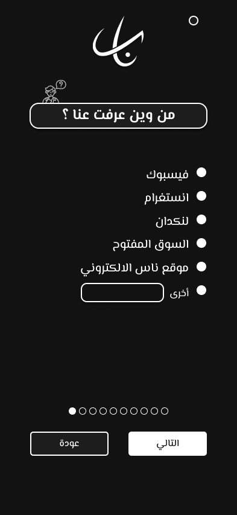
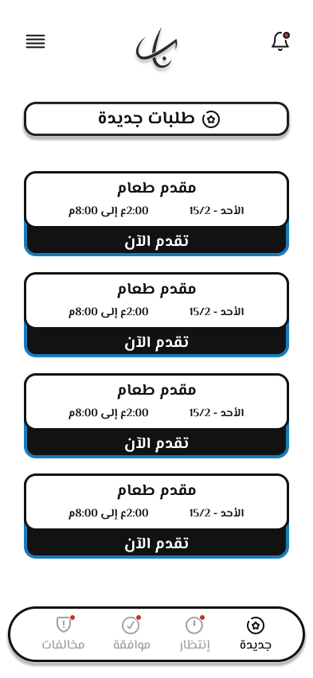
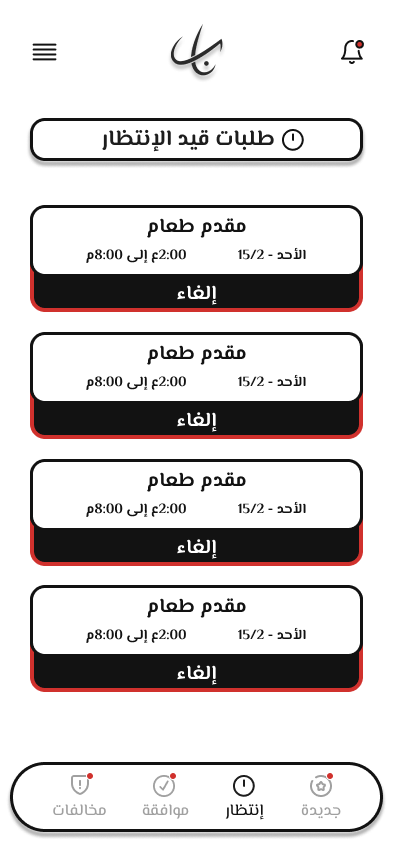
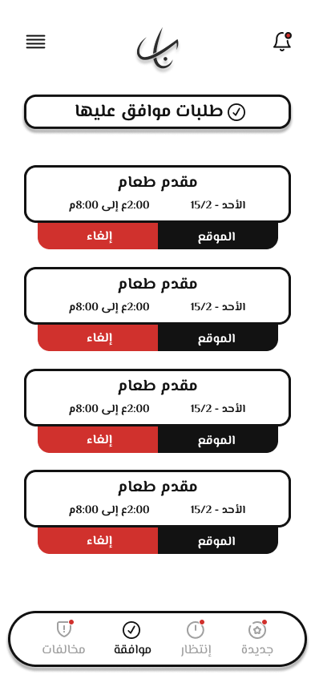
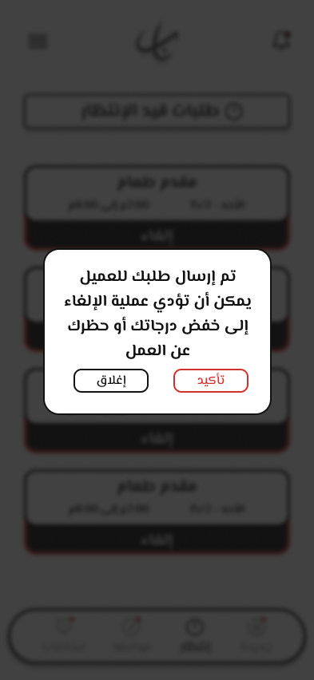
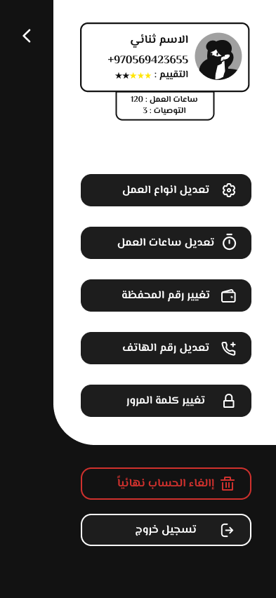
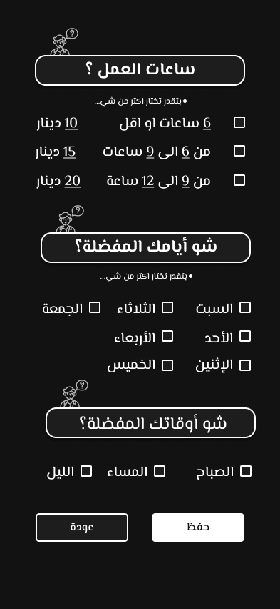

# NAS - Job Management App 🚀

<div align="center">
  
  
  [](https://flutter.dev/)
  [](https://dart.dev/)
  [](LICENSE)
  
  **A comprehensive job management application for workers and employers**
</div>

---

## 📱 About The Project

NAS is a Flutter-based mobile application designed to streamline job applications and management for workers in various service sectors (food service, cleaning, logistics, etc.). The app provides a complete workflow from registration to job approval, with real-time status tracking and automated processes.

### Code2Career: Flutter Project Milestone 1
This project was developed as part of the Gaza Sky Geeks training program, demonstrating proficiency in:
- ✅ State Management (BLoC Pattern)
- ✅ Local Database Storage (SQLite)
- ✅ Remote API Integration (DummyJSON for notifications)
- ✅ Authentication System
- ✅ Clean Architecture
- ✅ Media Handling (Image Picker)
- ✅ Push Notifications (Firebase Cloud Messaging)

---

## ✨ Features

### 🔐 Authentication System
- **Local Authentication** with SQLite database
- **User Registration** with 10-step wizard:
  - Personal information
  - Job type selection
  - Work hours & availability
  - Payment details (CLIQ wallet)
  - Document uploads (ID, personal photo)
  - Emergency contacts
  - Terms & conditions acceptance
- **Remember Me** functionality
- **Password Recovery** workflow

### 🏠 Main Dashboard
- **4 Job Categories**:
  - 🆕 **New Jobs**: Browse available job listings
  - ⏳ **Waiting**: Track pending applications
  - ✅ **Approved**: View accepted jobs with location
  - ⚠️ **Violations**: Monitor policy infractions

### 📋 Job Management
- **Auto-Approval System**: Applications automatically approved after 1 minute
- **Real-time Status Updates**: Jobs move between categories automatically
- **Job Details View**: Complete job information with requirements
- **Cancellation Workflow**: With warnings about rating impact
- **Location Integration**: Google Maps for job locations

### 🔔 Notifications
- **Push Notifications** via Firebase Cloud Messaging
- **Local Notifications** for app events
- **Notification Center** with read/unread status
- **Mark All as Read** functionality

### 👤 User Profile & Settings
- **Profile Management**:
  - Edit job types
  - Modify working hours
  - Update wallet number
  - Change phone number
  - Change password
- **Account Deletion** option
- **Logout** functionality

### 🎨 UI/UX Features
- **RTL Support** for Arabic language
- **Custom Snackbars** with animations
- **Loading Indicators**
- **Error Handling** with user-friendly messages
- **Smooth Animations** and transitions
- **Responsive Design** for various screen sizes

---

## 🏗️ Architecture

### Project Structure
```
lib/
├── controller/              # GetX Controllers
│   ├── home/               # Home screen controllers
│   └── registration/       # Registration wizard controllers
├── core/
│   ├── constant/           # App constants (theme, routes, URLs)
│   ├── database/           # SQLite database helper
│   ├── network/            # API client
│   └── utils/              # Shared preferences helper
├── data/
│   ├── models/             # Data models
│   └── repositories/       # Data repositories
├── presentation/
│   ├── bloc/               # BLoC state management
│   │   ├── auth/           # Authentication BLoC
│   │   ├── jobs/           # Jobs BLoC
│   │   ├── notifications/  # Notifications BLoC
│   │   └── violations/     # Violations BLoC
│   └── view/
│       ├── screen/         # App screens
│       └── widget/         # Reusable widgets
└── main.dart
```

### State Management Strategy
- **BLoC Pattern** for complex state management (jobs, notifications, violations)
- **GetX** for navigation and simple state
- **ValueNotifier** for local widget state

### Data Flow
```
UI Layer (Screens/Widgets)
    ↓
BLoC Layer (Business Logic)
    ↓
Repository Layer (Data Sources)
    ↓
Data Layer (API/Database)
```

---

## 🛠️ Technologies & Packages

### Core Dependencies
```yaml
dependencies:
  flutter_bloc: ^8.1.3          # State management
  get: ^4.6.6                   # Navigation & simple state
  sqflite: ^2.3.0               # Local database
  dio: ^5.4.0                   # HTTP client
  
  # UI & Design
  flutter_screenutil: ^5.9.0    # Responsive UI
  auto_size_text: ^3.0.0        # Auto-sizing text
  flutter_svg: ^2.0.9           # SVG support
  smooth_page_indicator: ^1.1.0 # Page indicators
  
  # Media & Files
  image_picker: ^1.0.7          # Image selection
  
  # Firebase
  firebase_core: ^2.24.2        # Firebase core
  firebase_messaging: ^14.7.10  # Push notifications
  flutter_local_notifications: ^16.3.0  # Local notifications
  
  # Location
  google_maps_flutter: ^2.5.3   # Maps integration
  geocoding: ^2.1.1             # Address conversion
  
  # Storage
  shared_preferences: ^2.2.2    # Key-value storage
  
  # Utilities
  equatable: ^2.0.5             # Value equality
```

---

## 📊 Database Schema

### Users Table
```sql
CREATE TABLE users (
  id INTEGER PRIMARY KEY AUTOINCREMENT,
  phone TEXT,
  firstName TEXT,
  fatherName TEXT,
  grandFatherName TEXT,
  familyName TEXT,
  birthDate TEXT,
  accountName TEXT,
  departmentName TEXT,
  accountNumber TEXT,
  workHours TEXT,
  selectedTasks TEXT,
  acceptAlcohol INTEGER,
  governorate TEXT,
  district TEXT,
  location TEXT,
  nationalId TEXT,
  nationality TEXT,
  gender TEXT,
  maritalStatus TEXT,
  countryCode TEXT,
  personalImage TEXT,
  frontIdImage TEXT,
  backIdImage TEXT,
  password TEXT,
  firstContact TEXT,
  secondContact TEXT,
  acceptedTerms TEXT,
  token TEXT,
  createdAt INTEGER
)
```

### Jobs Table
```sql
CREATE TABLE jobs (
  id INTEGER PRIMARY KEY AUTOINCREMENT,
  title TEXT,
  day TEXT,
  date TEXT,
  startTime TEXT,
  endTime TEXT,
  description TEXT,
  location TEXT,
  salary TEXT,
  requirements TEXT,
  status TEXT,
  appliedBy INTEGER,
  isPending INTEGER,
  createdAt INTEGER
)
```

---

## 🚀 Getting Started

### Prerequisites
- Flutter SDK (3.x or higher)
- Dart SDK (3.x or higher)
- Android Studio / VS Code
- Firebase account (for notifications)

### Installation

1. **Clone the repository**
```bash
git clone https://github.com/Israa-e/nas_mobile_master.git
cd nas-app
```

2. **Install dependencies**
```bash
flutter pub get
```

3. **Configure Firebase**
   - Create a Firebase project
   - Add Android/iOS apps
   - Download `google-services.json` (Android) and `GoogleService-Info.plist` (iOS)
   - Place them in the respective directories

4. **Run the app**
```bash
flutter run
```

### Test Credentials
```
Phone: 0599123456
Password: 123456
```

---

## 📸 Screenshots

### Authentication Flow
<div align="center">
  
  
  
</div>

### Job Management
<div align="center">
  
  
  
  
</div>

### Profile & Settings
<div align="center">
  
  
  
</div>

---

## 🔄 App Workflow

### 1. Registration Process
```
Step 1: How did you hear about us?
Step 2: Select job types
Step 3: Choose available days & times
Step 4: Set working hours & payment details
Step 5: Enter full name & birth date
Step 6: Provide address & nationality
Step 7: Gender, marital status & phone
Step 8: Upload documents & set password
Step 9: Emergency contacts
Step 10: Accept terms & conditions
```

### 2. Job Application Flow
```
Browse New Jobs → View Details → Apply → 
Auto-Approval (1 min) → Move to Approved → 
Navigate to Location
```

### 3. Cancellation Flow
```
View Pending/Approved Job → Click Cancel → 
Warning Dialog → Confirm → 
Job Returns to New (+ Violation Record)
```

---

### Known Issues
- [ ] Auto-approval timer resets on app restart
- [ ] Background notifications may be delayed on iOS
- [ ] Image upload requires storage permissions

---

## 🎯 Future Enhancements

- [ ] Employer dashboard
- [ ] Real-time chat between workers and employers
- [ ] Rating and review system
- [ ] Payment integration
- [ ] Job recommendations based on user profile
- [ ] Calendar view for scheduled jobs
- [ ] Multi-language support (English)
- [ ] Dark mode theme

---

## 👥 Contributors

- **IsraaElhalaby** - *Lead Developer* - [GitHub Profile](https://github.com/Israa-e)

## 🙏 Acknowledgments

- **Gaza Sky Geeks** for the training program
- **Code2Career** initiative
- Flutter community for excellent packages
- Material Design and Cupertino for UI inspiration

---

## 📞 Contact & Support

- **Email**: israa00elhalby@gmail.com

---

<div align="center">
  <p>Made with ❤️ in Palestine 🇵🇸</p>
  <p>© 2025 NAS App. All rights reserved.</p>
</div>